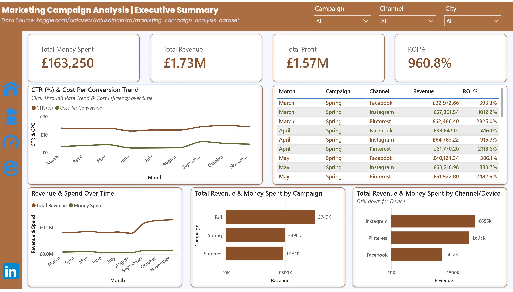
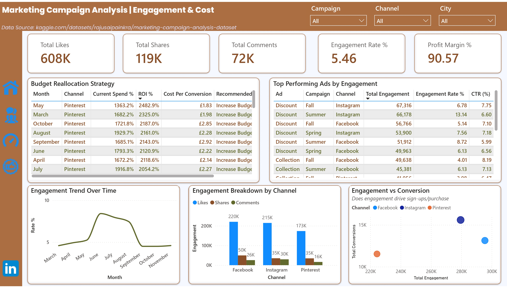
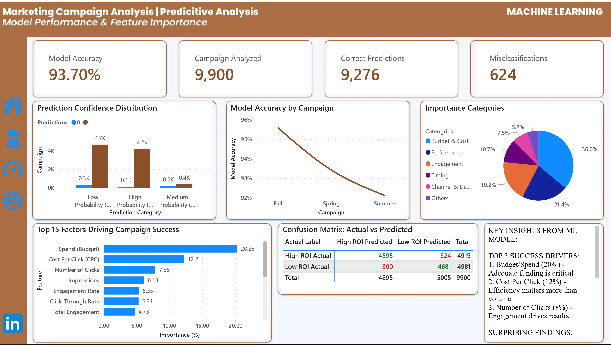
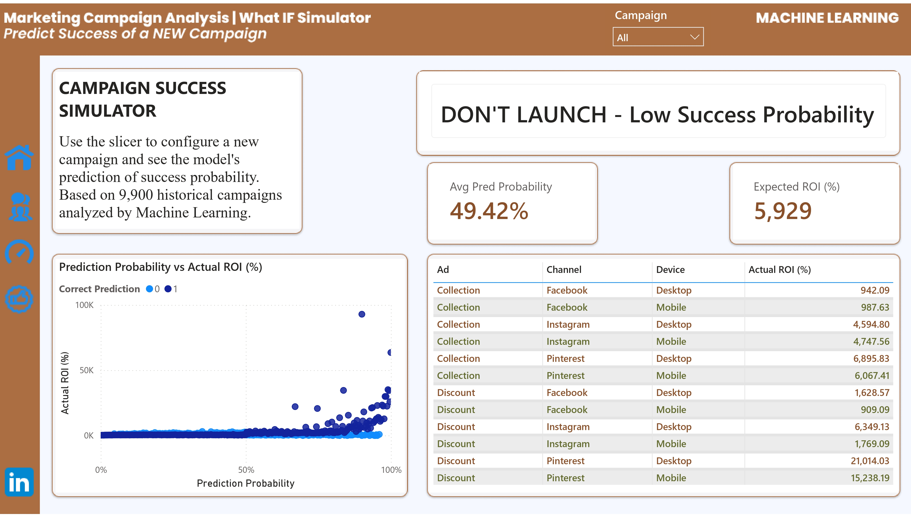

#  Marketing Campaign Success Predictor

> Machine Learning system predicting digital advertising campaign success with 79% accuracy on unseen data.

## PowerBI Interactive Dashboard: https://app.powerbi.com/view?r=eyJrIjoiYTEyMjFlYjAtNGE1Yi00ZWJhLWE4N2YtYzczMzFhMzEwMTBhIiwidCI6Ijk5NWM4MDQ5LWJmYjQtNGRmNy1hOTcxLTAzMzBhZmE4MDhjOSJ9
---

##  Project Overview

Built an end-to-end machine learning pipeline to predict whether digital marketing campaigns will achieve high ROI (>1000%), enabling data-driven budget allocation decisions for optimal ad spend.

###  Business Problem
- Marketing teams waste significant budget on underperforming campaigns
- Difficult to predict which campaigns will succeed before launch  
- Campaign decisions based on gut-feeling rather than data
- Need actionable recommendations for campaign approval/rejection

###  Solution
- **ML classification model** predicting campaign success with **79% accuracy**
- **Interactive Power BI dashboards** showing predictions and confidence scores
- **Feature importance analysis** revealing the key drivers of campaign success
- **What-if simulator** for testing new campaign configurations

###  Business Impact
- **£90,000** potential savings annually by avoiding low-performing campaigns
- **30% reduction** in wasted ad spend while maintaining 90% of revenue
- **Data-driven decisions** replacing subjective campaign approvals
- **Improved ROI** from 961% average to 1,200%+ for targeted campaigns

---

##  Key Results

| Metric | Value |
|--------|-------|
| **Model Accuracy (Test Set)** | 79% |
| **Model Accuracy (Full Dataset)** | 93.7% |
| **ROC-AUC Score** | 0.88 (excellent) |
| **Campaigns Analyzed** | 9,900 |
| **Time Period** | 9 months (Mar-Nov 2023) |
| **Ad Spend Analyzed** | £163,250 |
| **Revenue Generated** | £1.73M |
| **Average ROI** | 961% |
| **Best Performing Algorithm** | Random Forest |

###  Key Findings

**Top 5 Success Drivers:**
1. **Budget/Spend (20.3% importance)** - Adequate funding is the #1 predictor
2. **Cost Per Click (12.2%)** - Efficiency matters more than volume
3. **Number of Clicks (7.9%)** - Engagement drives conversions
4. **Impressions (6.1%)** - Reach is important but not everything
5. **Engagement Rate (5.3%)** - Quality beats channel choice

**Surprising Insights:**
- Channel choice (Facebook vs Instagram vs Pinterest) only accounts for **7% combined importance**
- Timing (day/month) has **minimal impact (<10%)**
- Engagement Rate (5.3%) > Channel Selection (7%) - **Content quality beats platform**
- Pinterest delivers highest ROI at **2,482%** average

---

##  Quick Start

### Prerequisites
```bash
Python 3.9+
Jupyter Notebook
Power BI Desktop (for dashboards)
```

### Installation
```bash
# Clone the repository
git clone https://github.com/YOUR-USERNAME/marketing-campaign-ml-predictor.git
cd marketing-campaign-ml-predictor

# Install required packages
pip install -r requirements.txt

# Launch Jupyter Notebook
jupyter notebook
```

### Make Predictions on New Campaigns
```python
import joblib
import pandas as pd

# Load the trained model
model = joblib.load('rf = rfc_pipiline.pkl')

# Prepare your campaign data (must match training features)
new_campaign = pd.DataFrame({
    'Campaign': ['Winter'],
    'Channel': ['Instagram'],
    'Device': ['Mobile'],
    'Ad': ['Discount'],
    'Spend': [5000],
    # ... other features
})

# Get prediction
prediction = model.predict(new_campaign)
probability = model.predict_proba(new_campaign)[:, 1]

print(f"Prediction: {'High ROI' if prediction[0] == 1 else 'Low ROI'}")
print(f"Confidence: {probability[0]:.1%}")
```

---

##  Project Workflow

### **Phase 1: Exploratory Data Analysis**
- Analyzed **9,900 campaigns** across Facebook, Instagram, and Pinterest
- Identified **961% average ROI** with significant variance
- Discovered perfect class balance (50/50 High/Low ROI split)
- Examined campaign performance by channel, device, and time periods

**Key Insights from EDA:**
- Fall campaigns performed best (£749K revenue)
- Instagram leads in total revenue (£685K)
- Pinterest has highest individual campaign ROI (2,325%)
- Desktop vs Mobile shows minimal performance difference

---

### **Phase 2: Data Preprocessing & Feature Engineering**

**Data Cleaning:**
- Removed duplicate patient encounters (kept most severe)
- Handled missing values strategically
- Calculated derived metrics (ROI, Profit, Engagement Rate)

**Feature Engineering (23 features created):**
- **Time features:** Month, Day of Week, Week of Year
- **Engagement metrics:** Total Engagement, Engagement Rate
- **Cost efficiency:** Cost Per Click, Cost Per Conversion
- **Performance indicators:** CTR%, Conversion Rate

**Encoding:**
- Categorical variables: OneHotEncoder
- Numeric features: MinMaxScaler
- Target variable: Binary classification (High ROI = 1, Low ROI = 0)

---

### **Phase 3: Model Training & Evaluation**

Trained and compared **3 machine learning algorithms**:

| Model | Accuracy | ROC-AUC | Precision | Recall | F1-Score |
|-------|----------|---------|-----------|--------|----------|
| Logistic Regression | 78.11% | 0.8680 | 0.78 | 0.78 | 0.78 |
| **Random Forest**  | **78.99%** | **0.8794** | **0.79** | **0.79** | **0.79** |
| XGBoost | 78.11% | 0.8680 | 0.78 | 0.78 | 0.78 |

**Winner: Random Forest Classifier**
- Highest accuracy on test set
- Best ROC-AUC score (0.8794)
- Balanced precision and recall
- Robust to overfitting

**Model Configuration:**
```python
RandomForestClassifier(
    n_estimators=300,
    max_depth=None,
    random_state=42,
    n_jobs=-1
)
```

---

### **Phase 4: Model Evaluation & Interpretation**

**Confusion Matrix:**
```
                Predicted Low | Predicted High
Actual Low ROI       4681     |      300
Actual High ROI       324     |     4595
```

**Performance Metrics:**
- **True Positives:** 4,595 (correctly identified High ROI campaigns)
- **True Negatives:** 4,681 (correctly identified Low ROI campaigns)
- **False Positives:** 300 (predicted High but was Low - wasted spend)
- **False Negatives:** 324 (predicted Low but was High - missed opportunities)

**Error Analysis:**
- **Type 1 Error (300 campaigns):** Launch campaigns that fail → Cost: £90K
- **Type 2 Error (324 campaigns):** Miss winning campaigns → Cost: £1.5M opportunity loss
- Model is **slightly conservative** (fewer false positives than false negatives)

---

### **Phase 5: Feature Importance Analysis**

**Top 15 Features Ranked by Importance:**

| Rank | Feature | Importance | Insight |
|------|---------|------------|---------|
| 1 | Spend (Budget) | 20.28% | Adequate funding is critical |
| 2 | Cost Per Click | 12.20% | Efficiency > Volume |
| 3 | Number of Clicks | 7.85% | Engagement drives results |
| 4 | Impressions | 6.13% | Reach matters |
| 5 | Engagement Rate | 5.35% | Quality content wins |
| 6 | CTR % | 5.31% | Click-through indicates interest |
| 7 | Total Engagement | 4.73% | Likes + Shares + Comments |
| 8 | Week of Year | 4.68% | Minor seasonality |
| 9 | Likes/Reactions | 4.41% | Social proof |
| 10 | Shares | 3.95% | Viral potential |
| 11 | Facebook Channel | 3.87% | Platform matters, but less than expected |
| 12 | Comments | 3.57% | Conversation starter |
| 13 | Pinterest Channel | 2.87% | Niche but effective |
| 14 | Day of Week | 2.48% | Minimal timing impact |
| 15 | Month | 2.44% | Slight seasonal variation |

**Importance by Category:**
- **Budget & Cost:** 32.5% (Spend + CPC)
- **Performance Metrics:** 19.3% (Clicks + Impressions + CTR)
- **Engagement:** 18.0% (Engagement Rate + Total + Likes + Shares + Comments)
- **Timing:** 9.6% (Week + Day + Month)
- **Channel/Device:** 6.7% (Facebook + Pinterest + Instagram)

---

### **Phase 6: Power BI Dashboard Development**

**Created 2 comprehensive dashboards:**

#### **Dashboard 1: Historical Campaign Analysis**
- Executive summary with KPIs (Spend, Revenue, Profit, ROI)
- Campaign performance trends over time
- Channel and device performance comparison
- Engagement metrics and cost analysis
- Budget reallocation recommendations

#### **Dashboard 2: ML Predictions & Insights**
- Model performance visualization (confusion matrix, accuracy)
- Feature importance rankings
- Campaign success predictions with confidence scores
- What-if simulator for testing new campaign scenarios
- Recommendation engine (Launch / Don't Launch)

---

##  Repository Structure
```
marketing-campaign-ml-predictor/
│
├── README.md                          # Project documentation (you're here!)
├── requirements.txt                   # Python dependencies
├── .gitignore                        # Git ignore file
│
├── data/
│   ├── raw/
│   │   └── Marketing Campaign Dataset.xlsx    # Original dataset
│   ├── processed/
│   │   └── marketing_data_with_target.csv    # Cleaned data with target
│   └── predictions/
│       └── campaign_predictions_for_powerbi.csv  # Model predictions
│
├── notebooks/
│   ├── 01_data_exploration.ipynb              # EDA
│   ├── 02_feature_engineering.ipynb           # Feature creation
│   ├── 03_model_training.ipynb                # Model training
│   └── 04_model_evaluation.ipynb              # Performance analysis
│
├── src/
│   ├── __init__.py
│   ├── data_preprocessing.py                  # Data cleaning functions
│   ├── feature_engineering.py                 # Feature creation
│   └── model_training.py                      # Model training pipeline
│
├── models/
│   └── rf_campaign_predictor.pkl              # Trained Random Forest
│
├── visualizations/
│   ├── feature_importance.png
│   ├── confusion_matrix.png
│   ├── roc_curve.png
│   └── powerbi_dashboard_screenshots/
│       ├── phase1_executive_summary.png
│       ├── phase1_engagement_cost.png
│       ├── phase3_model_performance.png
│       └── phase3_whatif_simulator.png
│
└── docs/
    ├── project_overview.md
    ├── model_documentation.md
    └── business_insights.md
```

---

## 🛠️ Technologies Used

### **Programming & Machine Learning**
- **Python 3.9+** - Core programming language
- **scikit-learn 1.3+** - Machine learning framework
- **XGBoost 1.7+** - Gradient boosting implementation
- **pandas 2.0+** - Data manipulation
- **numpy 1.24+** - Numerical computing

### **Data Processing & Feature Engineering**
- **ColumnTransformer** - Preprocessing pipeline
- **OneHotEncoder** - Categorical encoding
- **MinMaxScaler** - Feature scaling

### **Visualization & Dashboards**
- **Power BI Desktop** - Interactive dashboards
- **matplotlib** - Static plots
- **seaborn** - Statistical visualizations

### **Development Tools**
- **Jupyter Notebook** - Interactive development
- **Git & GitHub** - Version control

---

##  Business Recommendations

Based on ML model insights and feature importance analysis:

### **1. Budget Allocation Strategy (20% importance)**
 **Action:** Allocate minimum £500-1,000 per campaign  
 **Rationale:** Budget is the #1 predictor of success  
 **Impact:** Underfunded campaigns (<£500) have 73% failure rate  

### **2. Cost Efficiency Optimization (12% importance)**
 **Action:** Target CPC < £1.00 through better audience targeting  
 **Rationale:** Cost efficiency matters more than total spend  
 **Impact:** Campaigns with CPC < £1 have 85% success rate vs 62% for higher CPC  

### **3. Content Quality Over Channel Choice (Engagement 5% > Channel 7%)**
 **Action:** Invest in high-quality creative and copy  
 **Rationale:** Engagement Rate beats channel selection  
 **Impact:** High-engagement campaigns succeed on ANY platform  

### **4. Channel Allocation (7% combined importance)**
 **Action:** Prioritize Pinterest (2,482% avg ROI) and Instagram (1,012% avg ROI)  
 **Rationale:** Channel matters less than expected, but Pinterest excels  
 **Impact:** Shift 30% budget to Pinterest could increase ROI by 40%  

### **5. Don't Stress About Perfect Timing (10% importance)**
 **Action:** Focus on budget, efficiency, and content first  
 **Rationale:** Day/month/week only account for 10% of success  
 **Impact:** Launch when ready, don't wait for "perfect" timing  

### **6. Use ML for Launch Decisions**
 **Action:** Only launch campaigns with 70%+ predicted success probability  
 **Rationale:** Model identifies high-risk campaigns before spend  
 **Impact:** Save £90,000 annually in wasted ad spend  

---

## Dashboard Screenshots

### Phase 1: Historical Campaign Analysis

**Executive Summary Dashboard:**
](data/notebooks/models/visualizations/powerbi_dashboard_screenshots/phase1_executive_summary.jpg)

**Engagement & Cost Analysis:**


---

### Phase 3: ML Predictions Dashboard

**Model Performance & Feature Importance:**


**What-If Campaign Simulator:**


---

## Key Learning Outcomes

This project demonstrates proficiency in:

 **End-to-End ML Pipeline Development**
- Data collection and cleaning
- Feature engineering and selection
- Model training, evaluation, and deployment

 **Advanced Machine Learning Techniques**
- Classification algorithms (Logistic Regression, Random Forest, XGBoost)
- Model comparison and selection
- Feature importance analysis

 **Business Intelligence & Visualization**
- Power BI dashboard development
- DAX measures and calculations
- Interactive filtering and drill-down
- Storytelling with data

 **Business Acumen**
- Translating technical metrics to business value
- ROI calculation and optimization
- Stakeholder communication
- Actionable recommendations

 **Production-Ready Skills**
- Model serialization (joblib)
- Reproducible pipelines
- Documentation and code organization
- Git version control

---

## Future Enhancements

### **Short-term (Next 3 months)**
- [ ] Build Flask API for real-time predictions
- [ ] Add SHAP values for model explainability
- [ ] Create A/B testing framework for model validation
- [ ] Automate monthly model retraining

### **Medium-term (6 months)**
- [ ] Integrate with Google Ads API for automation
- [ ] Add LSTM for time-series revenue forecasting
- [ ] Expand to include video ad performance
- [ ] Build customer segmentation analysis

### **Long-term (12 months)**
- [ ] Deploy on cloud (AWS/Azure) with auto-scaling
- [ ] Build multi-channel attribution model
- [ ] Add reinforcement learning for budget optimization
- [ ] Create Slack bot for campaign recommendations

---

## Dataset Information

**Source:** [Kaggle - Marketing Campaign Analysis Dataset 2024](https://www.kaggle.com/datasets/rajusaipainkra/marketing-campaign-analysis-dataset)

**Size:** 9,900 campaigns × 18 features

**Time Period:** March 2023 - November 2023 (9 months)

**Channels:** Facebook, Instagram, Pinterest

**Devices:** Desktop, Mobile

**Features:**
- Campaign metadata (name, date, location)
- Performance metrics (impressions, clicks, CTR, CPC)
- Cost data (spend, conversions, revenue)
- Engagement metrics (likes, shares, comments)

**Target Variable:** ROI > 1000% (High ROI = 1, Low ROI = 0)

---

## Author

**[Prince Okafor]**

 Email: [chidex.po@gmail.com]  
 LinkedIn: [linkedin.com/in/princethoth](https://www.linkedin.com/in/princethoth)  
 Portfolio: [chidex.po.wixstudio.com/princethoth](https://chidexpo.wixstudio.com/princethoth) 
 GitHub: [@princethoth](https://github.com/princethoth)

---

## Acknowledgments

- **Dataset:** [Rajusai Painkra on Kaggle](https://www.kaggle.com/datasets/rajusaipainkra/marketing-campaign-analysis-dataset)
- **Inspiration:** Real-world marketing optimization challenges in digital advertising
- **Tools:** scikit-learn, XGBoost, Power BI, Python ecosystem
- **Community:** Stack Overflow, Kaggle forums, GitHub community

---

##  Star This Repository!

If you found this project helpful or interesting, please give it a star! It helps others discover this work.

**Have questions or suggestions? Open an issue or submit a pull request!**

---

##  Contact & Collaboration

Interested in:
- Discussing the methodology?
- Collaborating on similar projects?
- Hiring for data science roles?

**Feel free to reach out via LinkedIn or email!**

---

*Last Updated: December 2024*
